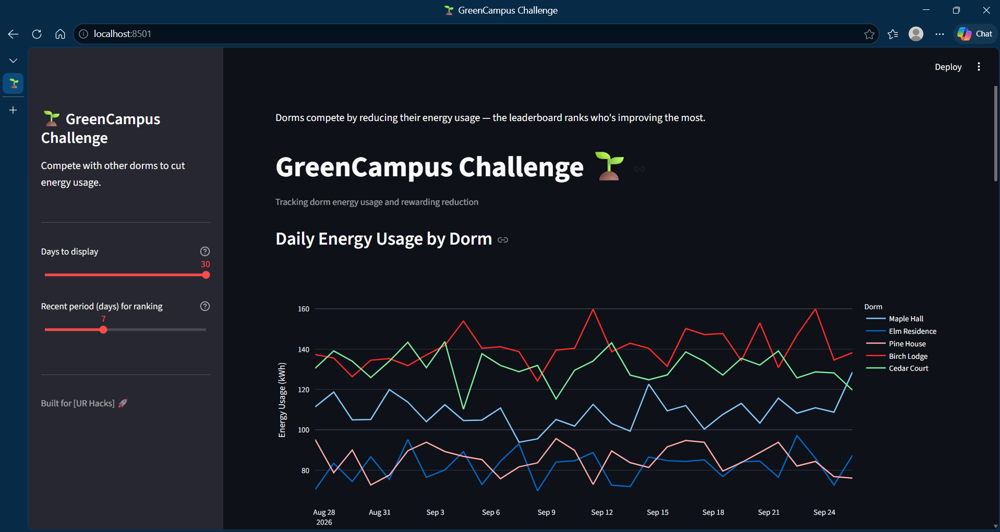
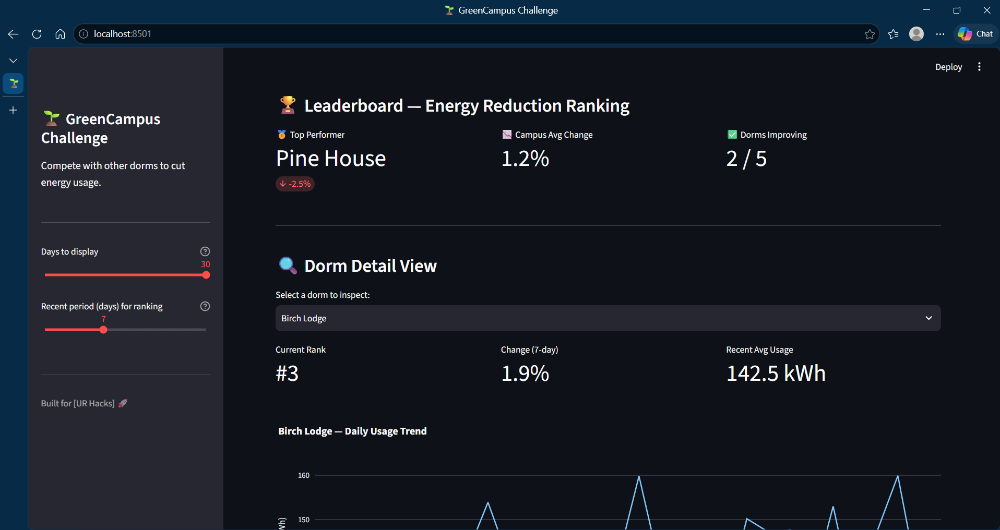
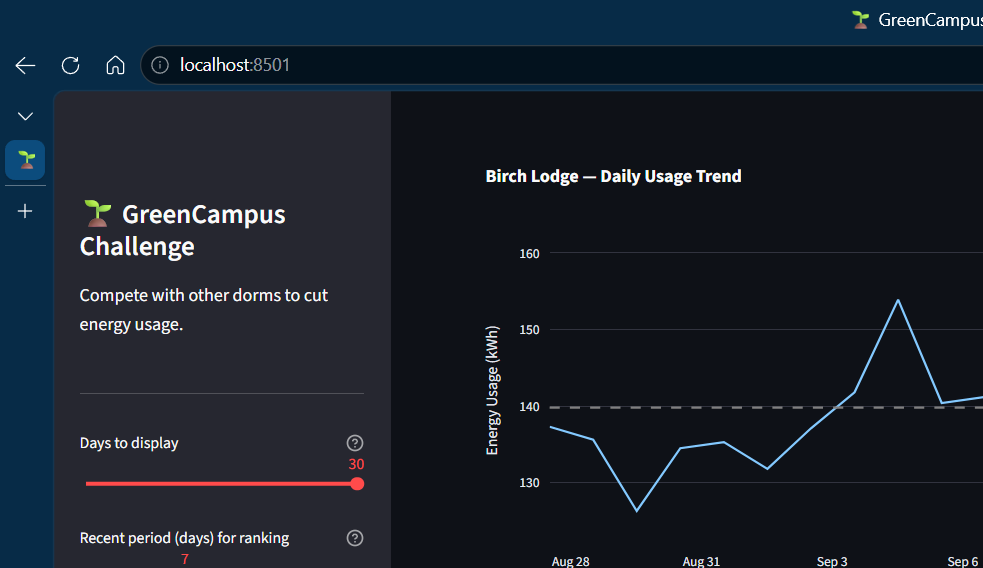
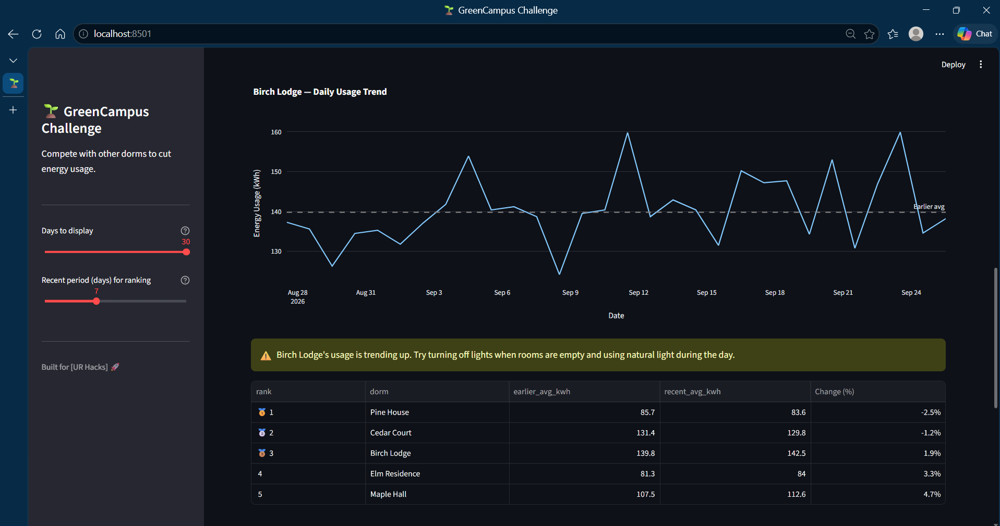
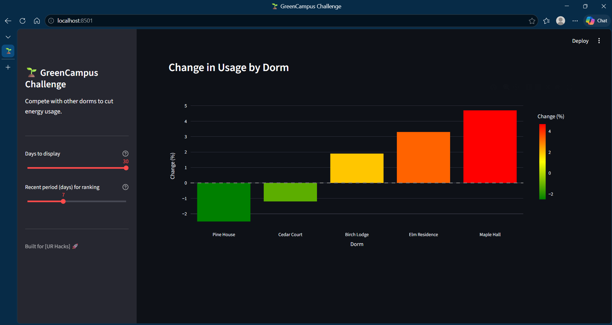

# GreenCampus Challenge🌱

A Streamlit dashboard that visualizes (mock) energy usage data for university dorms and ranks them on a leaderboard based on who's reducing their usage the most — turning sustainability into a friendly competition.

## What it does

- Simulates daily energy usage (kWh) data for 5 dorms over a 30-day period
- Visualizes usage trends over time with interactive charts
- Ranks dorms on a leaderboard by % change in recent usage vs. earlier usage
- Lets you drill into a single dorm's trend and see a tailored tip
- Adjustable sliders to control the time window and ranking period

## Tech stack

- **Python**
- **Streamlit** — dashboard/UI
- **Pandas / NumPy** — mock data generation and calculations
- **Plotly** — interactive charts

## Project structure

```
greencampus-challenge/
├── app.py                  # Main Streamlit app
├── data/
│   └── mock_energy.py      # Generates mock dorm energy data
├── utils/
│   └── scoring.py          # Leaderboard ranking logic
└── requirements.txt
```

## Running it locally

1. Clone the repo and move into the project folder:
   ```bash
   git clone <your-repo-url>
   cd GreenCampus
   ```

2. Install dependencies:
   ```bash
   pip install -r requirements.txt
   ```

3. Run the app:
   ```bash
   streamlit run app.py
   ```

4. Open the link Streamlit gives you (usually `http://localhost:8501`).
```
   Uvicorn server started on :::8501

   You can now view your Streamlit app in your browser.

   Local URL: http://localhost:8501
   Network URL: http://172.16.1.70:8501

   Help agents write better Streamlit apps?
   Install the official Streamlit skills by running streamlit skills in your terminal.
```

## Screenshots






## Notes

- All data is **simulated** for demo purposes — it does not reflect real dorm energy usage.
- The leaderboard ranks dorms by percentage change in average usage between an "earlier" period and a "recent" period (both adjustable via the sidebar sliders).
